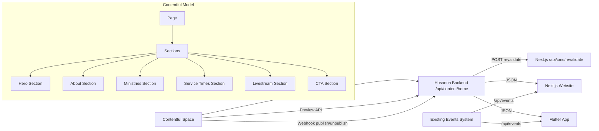

# Hosanna Contentful CMS Integration Blueprint

## 1) Objectives
- Use Contentful as the shared CMS for both:
  - Hosanna website (Next.js)
  - Hosanna native mobile app (Flutter)
- Keep **events dynamic** in the existing backend/events workflow.
- Expose one normalized backend CMS API contract for both clients.
- Support published and preview content.
- Provide safe fallback behavior when CMS is unavailable.

## 2) Architecture Overview



### Key principle
- **CMS content**: delivered via `/api/content/home`
- **Contentful is page-driven**: `Page` owns ordered `Sections`
- **Events content**: still delivered via `/api/events` (unchanged)

## 3) Existing Events + CMS Coexistence
- Events remain in your current pipeline (`/api/events` routes, Firebase-backed workflow).
- Website and Flutter continue consuming events exactly as they do today.
- Contentful is introduced only for shared CMS-managed home content and future static/editorial sections.
- No event write-path migration is required.

## 4) Implemented Backend Changes (hosanna-app-backend)

### 4.1 New routes
- `GET /api/content/home`
  - Query:
    - `locale` (default: `en-US`)
    - `preview=1` for preview reads
  - Header:
    - `x-cms-preview-key` required when `preview=1`
- `POST /api/content/webhook/contentful`
  - Header:
    - `x-hosanna-webhook-secret`
  - Action:
    - invalidates CMS cache
    - optionally triggers website revalidation endpoint

### 4.2 New backend files
- `src/api/routes/content.routes.js`
- `src/services/contentful.service.js`
- `src/services/cms.service.js`
- `src/services/cache.service.js`
- `scripts/contentful/page-sections-model.json`

### 4.3 Backend wiring
- `src/server.js`
  - Registers `app.use('/api/content', contentRouter)`

### 4.4 Backend environment additions
- `CONTENTFUL_SPACE_ID`
- `CONTENTFUL_ENVIRONMENT_ID` (default `master`)
- `CONTENTFUL_DELIVERY_TOKEN`
- `CONTENTFUL_PREVIEW_TOKEN`
- `CONTENTFUL_WEBHOOK_SECRET`
- `CMS_PREVIEW_KEY`
- `CONTENTFUL_REQUEST_TIMEOUT_MS` (default `8000`)
- `CMS_CACHE_TTL_SECONDS` (default `300`)
- `WEBSITE_REVALIDATE_URL` (optional)

### 4.5 Backend package
- Added dependency: `contentful`

## 5) Implemented Website Changes (v0-church-website-design)

### 5.1 Shared CMS fetch layer
- `lib/cms-home.ts`
  - Fetches `/api/content/home`
  - Supports preview header
  - Uses `revalidate: 300` with cache tag `cms-home`
  - Graceful `try/catch` fallback to avoid build failures when backend is unavailable

### 5.2 Home page CMS wiring
- `app/page.tsx`
  - Server fetches CMS home payload
  - Passes hero data into `HeroSection`
  - The payload is normalized by the backend from `Page -> Sections` into `home.hero`, `home.about`, and future section buckets

### 5.3 Hero section CMS support
- `components/sections/hero-section.tsx`
  - Accepts optional `cmsHero`
  - Uses CMS slides/welcome/subtitle/cta if present
  - Falls back to existing local values otherwise

### 5.4 Website revalidation endpoint
- `app/api/cms/revalidate/route.ts`
  - Protected by `x-hosanna-webhook-secret`
  - Calls `revalidateTag('cms-home')`

### 5.5 Next image configuration
- `next.config.mjs`
  - Added remote pattern for `images.ctfassets.net`

### 5.6 Website environment additions
- `CMS_API_BASE_URL`
- `CMS_PREVIEW_KEY`
- `NEXT_PUBLIC_CMS_LOCALE`
- `CONTENTFUL_WEBHOOK_SECRET`

## 6) Implemented Flutter Changes (hosanna-app)

### 6.1 CMS data model
- `lib/features/home/models/cms_home_content.dart`

### 6.2 CMS service
- `lib/features/home/home_service.dart`
  - Calls `/content/home` via existing `ApiService`

### 6.3 Home page CMS rendering
- `lib/features/home/home_page.dart`
  - Converted to `StatefulWidget`
  - Loads shared CMS home payload with `FutureBuilder`
  - Displays hero and about cards
  - Includes loading/error/empty states

### 6.4 Flutter API base URL
- Uses existing `ApiService` setup:
  - `--dart-define=API_BASE_URL=https://your-backend-domain/api`

## 7) Recommended Contentful Content Models

## 7.1 Implemented model scaffold file
- `hosanna-app-backend/scripts/contentful/page-sections-model.json`

### 7.2 Content types
1. `page`
- `title` (Symbol, localized)
- `slug` (Symbol)
- `sections` (Array of links to section entries)

2. `heroSection`
- `title` (Symbol, localized)
- `type` (Symbol, default `hero`)
- `welcome` (Symbol, localized)
- `subtitle` (Text, localized)
- `buttonLabel` (Symbol, localized)
- `buttonUrl` (Symbol)
- `heroSlides` (Array of links to `heroSlide`)

3. `aboutSection`
- `title` (Symbol, localized)
- `type` (Symbol, default `about`)
- `eyebrow` (Symbol, localized)
- `description` (Text, localized)
- `cards` (Array of links to `card`)

4. `ministriesSection`
- `title` (Symbol, localized)
- `type` (Symbol, default `ministries`)
- `eyebrow` (Symbol, localized)
- `description` (Text, localized)
- `ministries` (Array of links to `ministry`)

5. `serviceTimesSection`
- `title` (Symbol, localized)
- `type` (Symbol, default `serviceTimes`)
- `eyebrow` (Symbol, localized)
- `description` (Text, localized)
- `serviceTimes` (Array of links to `serviceTime`)

6. `livestreamSection`
- `title` (Symbol, localized)
- `type` (Symbol, default `livestream`)
- `description` (Text, localized)
- `buttonLabel` (Symbol, localized)
- `buttonUrl` (Symbol)

7. `ctaSection`
- `title` (Symbol, localized)
- `type` (Symbol, default `cta`)
- `description` (Text, localized)
- `buttonLabel` (Symbol, localized)
- `buttonUrl` (Symbol)

8. `heroSlide`
- `title` (Symbol, localized)
- `image` (Asset link)
- `imageAlt` (Symbol, localized)
- `linkUrl` (Symbol, optional)

9. `card`
- `title` (Symbol, localized)
- `description` (Text, localized)
- `image` (Asset link, optional)
- `linkUrl` (Symbol, optional)

10. `ministry`
- `title` (Symbol, localized)
- `slug` (Symbol)
- `description` (Text, localized)
- `image` (Asset link, optional)
- `buttonLabel` (Symbol, localized, optional)

11. `serviceTime`
- `day` (Symbol, localized)
- `time` (Symbol)
- `type` (Symbol, localized, optional)
- `location` (Symbol, localized, optional)
- `note` (Text, localized, optional)

12. `navigation`
- `label` (Symbol, localized)
- `href` (Symbol)
- `kind` (Symbol, optional)

13. `footer`
- `title` (Symbol, localized)
- `tagline` (Text, localized, optional)
- `links` (Array of links to `navigation`)

### 7.3 Localization
- Enable locales such as:
  - `en-US`
  - `es`
- Localize text fields; section ordering stays global per page.
- Hero images can remain shared if imagery is locale-agnostic.

## 8) Setup Script
- `hosanna-app-backend/scripts/contentful/import-content-model.sh`
- Imports `page-sections-model.json` into your Contentful space via Contentful CLI.

Usage:
```bash
cd hosanna-app-backend
export CONTENTFUL_MANAGEMENT_TOKEN=...
export CONTENTFUL_SPACE_ID=...
export CONTENTFUL_ENVIRONMENT_ID=master
./scripts/contentful/import-content-model.sh
```

## 9) API Contract (Shared for Website + Flutter)

`GET /api/content/home?locale=en-US`

Response example:
```json
{
  "source": "contentful",
  "locale": "en-US",
  "preview": false,
  "home": {
    "locale": "en-US",
    "updatedAt": "2026-08-01T12:00:00.000Z",
    "page": {
      "title": "Home",
      "slug": "/",
      "sections": [
        {
          "id": "...",
          "type": "hero",
          "title": "Hero",
          "welcome": "WELCOME",
          "subtitle": "A PLACE TO BELONG",
          "buttonLabel": "VISIT US",
          "heroSlides": []
        }
      ]
    },
    "sections": [],
    "hero": {
      "welcome": "WELCOME",
      "subtitle": "A PLACE TO BELONG",
      "ctaLabel": "VISIT US",
      "slides": [
        { "title": "Community", "imageUrl": "https://images.ctfassets.net/...", "imageAlt": "Community" }
      ]
    },
    "about": {
      "eyebrow": "ABOUT",
      "title": "OUR MISSION",
      "description": "...",
      "cards": [
        { "title": "Mission", "description": "..." }
      ]
    }
  }
}
```

## 10) Preview + Published Support
- Published content:
  - default `preview=false`, uses Delivery API token.
- Preview content:
  - `preview=1`, uses Preview API token.
  - requires header: `x-cms-preview-key`.
- Keep preview key secret and never expose it in public clients.

## 11) Webhook Configuration
In Contentful webhook settings:
- Trigger on: publish/unpublish/delete for `page` and linked section/content types (`heroSection`, `aboutSection`, `ministriesSection`, `serviceTimesSection`, `livestreamSection`, `ctaSection`)
- Also include child component types as needed: `heroSlide`, `card`, `ministry`, `serviceTime`, `navigation`, `footer`
- URL: `https://<backend-domain>/api/content/webhook/contentful`
- Method: `POST`
- Header:
  - `x-hosanna-webhook-secret: <CONTENTFUL_WEBHOOK_SECRET>`

Optional chained revalidation:
- Backend calls `WEBSITE_REVALIDATE_URL`:
  - `https://<website-domain>/api/cms/revalidate`
  - with same `x-hosanna-webhook-secret`

## 12) Caching Strategy
Backend:
- In-memory cache per key:
  - `cms:home:<locale>:<published|preview>`
- TTL: `CMS_CACHE_TTL_SECONDS` (default 300s)
- Invalidate on webhook publish/unpublish.
- The backend adapter can read either the new page/section model or the legacy `homePage` model during migration.

Website:
- `fetch(..., { next: { revalidate: 300, tags: ['cms-home'] } })`
- Tag revalidation via `/api/cms/revalidate`.

Flutter:
- Current implementation fetches on page load.
- Optional next step: add local persistence (Hive/shared_preferences) for offline-friendly cache.

## 13) Media Handling
- Contentful assets serve from `images.ctfassets.net`.
- Website Next.js allows this hostname for optimized images.
- Keep slide assets web-optimized in Contentful (recommended width: 1920, JPEG/WebP where possible).
- For mobile, same URLs can be rendered directly via `Image.network` if added later.

## 14) Error Handling + Fallbacks
Backend:
- If Contentful unavailable/misconfigured, returns fallback home payload.

Website:
- CMS fetch in `lib/cms-home.ts` catches network errors and returns null.
- Components keep existing hardcoded/translations fallback behavior.

Flutter:
- `FutureBuilder` shows loading spinner, user-friendly error message, or empty state.

## 15) Security Considerations
- Keep tokens server-side only:
  - Contentful delivery/preview tokens never in frontend/mobile binaries.
- Protect preview mode with `CMS_PREVIEW_KEY`.
- Protect webhook with `CONTENTFUL_WEBHOOK_SECRET` header validation.
- Keep CORS restricted on backend production domains.
- Continue Firebase auth middleware for protected routes (events writes unchanged).

## 16) Deployment Steps

### Backend
1. Add env vars from `.env.example` to Cloud Run/secret manager.
2. Deploy backend.
3. Verify:
   - `GET /api/content/home`
   - `POST /api/content/webhook/contentful` with header secret.

### Website
1. Add env vars:
   - `NEXT_PUBLIC_API_URL` or `CMS_API_BASE_URL`
   - `CONTENTFUL_WEBHOOK_SECRET`
   - optional `CMS_PREVIEW_KEY`
2. Deploy Next.js app.
3. Verify:
   - Home still renders if backend down (fallback)
   - `POST /api/cms/revalidate` with header secret works.

### Flutter
1. Build with backend URL:
```bash
flutter run --dart-define=API_BASE_URL=https://<backend-domain>/api
```
2. Verify home content from backend CMS endpoint.

## 17) Testing Instructions

### Backend tests (manual)
- Published:
```bash
curl "http://localhost:8080/api/content/home?locale=en-US"
```
- Preview:
```bash
curl "http://localhost:8080/api/content/home?locale=en-US&preview=1" \
  -H "x-cms-preview-key: $CMS_PREVIEW_KEY"
```
- Webhook:
```bash
curl -X POST "http://localhost:8080/api/content/webhook/contentful" \
  -H "x-hosanna-webhook-secret: $CONTENTFUL_WEBHOOK_SECRET"
```

### Website tests
- `npm run build`
- Check homepage renders with CMS when backend is reachable.
- Temporarily stop backend and verify homepage still builds/renders fallback.

### Flutter tests
- `flutter analyze`
- Launch app with `API_BASE_URL` dart define.
- Verify Home page renders CMS hero + about content.

## 18) Proposed Folder/File Structure

### Backend
- `src/api/routes/content.routes.js`
- `src/services/contentful.service.js`
- `src/services/cms.service.js`
- `src/services/cache.service.js`
- `scripts/contentful/page-sections-model.json`
- `scripts/contentful/import-content-model.sh`
- `.env.example`

### Website
- `lib/cms-home.ts`
- `app/api/cms/revalidate/route.ts`
- `app/page.tsx` (CMS fetch wiring)
- `components/sections/hero-section.tsx` (CMS props)
- `.env.example`

### Flutter
- `lib/features/home/models/cms_home_content.dart`
- `lib/features/home/home_service.dart`
- `lib/features/home/home_page.dart`

## 19) What Was Intentionally Not Changed
- Existing events domain model/services/routes were **not replaced**.
- Existing auth/event write protections remain intact.
- Existing website events rendering flow is untouched.

## 20) Optional Next Enhancements
- Add more CMS-managed sections (`latestSermons`, `testimonials`, `staffHighlights`) without changing the `Page` model.
- Add persistent cache layer (Redis) in backend for multi-instance consistency.
- Add Flutter local cache/offline mode for home content.
- Add integration tests for `/api/content/home` published/preview behavior.
